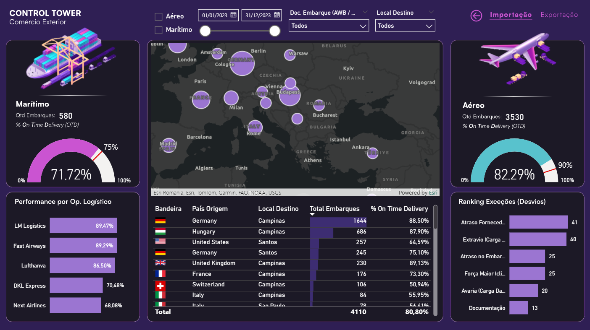

# ✈️🚢 Dashboard — Monitoramento de Logística Internacional

Control Tower para rastreamento de operações de comércio exterior com
foco em performance de embarques aéreos e marítimos.

---

## 🎯 Objetivo

Monitorar embarques internacionais de importação e exportação, identificar
desvios operacionais e acompanhar o On Time Delivery (OTD) por modal,
operador logístico e país de origem.

---

## 📊 KPIs Monitorados

| Indicador | Modal | Valor |
|---|---|---|
| **Qtd. Embarques** | Marítimo | 580 |
| **% On Time Delivery** | Marítimo | 71,72% (meta: 75%) |
| **Qtd. Embarques** | Aéreo | 3.530 |
| **% On Time Delivery** | Aéreo | 82,29% (meta: 90%) |
| **Total Embarques** | Geral | 4.110 |
| **OTD Geral** | Importação | 80,80% |

---

## 🔍 Análises Disponíveis

- **Mapa global de embarques** — visualização geográfica das origens via Esri/ArcGIS
- **Performance por Operador Logístico** — ranking de OTD por carrier
(LM Logistics, Fast Airways, Lufthansa, DKL Express, Next Airlines)
- **Tabela País de Origem x Local Destino** — total de embarques e % OTD por rota
- **Ranking de Exceções (Desvios)** — Atraso Fornecedor (41), Extravio de
Carga (40), Atraso no Embarque (25), Força Maior (25), Avaria (20), Documentação (13)
- **Filtros** — por modal (Aéreo/Marítimo), período, Doc. de Embarque
(AWB/BL) e Local Destino
- **Navegação** — alternância entre visões de Importação e Exportação

---

## 🗂️ Modelagem de Dados

Modelo em esquema estrela com 5 tabelas:

| Tabela | Tipo | Campos principais |
|---|---|---|
| **Historico Importacao** | Fato | Cód. Exceção, Data Coleta, Data Entrega, Doc. Embarque (AWB/BL), ID Operador Logístico, ID País Destino, ID País Origem, Incoterm, Local Destino, No. Invoice, Operação, País Origem, Prazo Contratual, Prazo Realizado, Status Entrega, Tipo, Tipo de Serviço, Volume (cbm) |
| **Bandeiras** | Dimensão | Bandeira, ID País Origem, País |
| **Cadastros Exceções** | Dimensão | Cód. Exceção, Descrição Desvio, Responsável |
| **Cadastros Operadores Logísticos** | Dimensão | ID Carrier, Operador Logístico |
| **Indicadores** | Medidas | % On Time Delivery, Meta Aéreo, Meta Marítimo, Qtd. Embarques no Prazo, Total Embarques |

---

## 📐 Medidas DAX

| Medida | Descrição |
|---|---|
| `% On Time Delivery` | Percentual de embarques entregues dentro do prazo |
| `Meta Aéreo` | Meta de OTD para modal aéreo (90%) |
| `Meta Marítimo` | Meta de OTD para modal marítimo (75%) |
| `Qtd. Embarques no Prazo` | Contagem de embarques dentro do prazo contratual |
| `Total Embarques` | Total geral de embarques no período |

---

## 🛠️ Tecnologias

